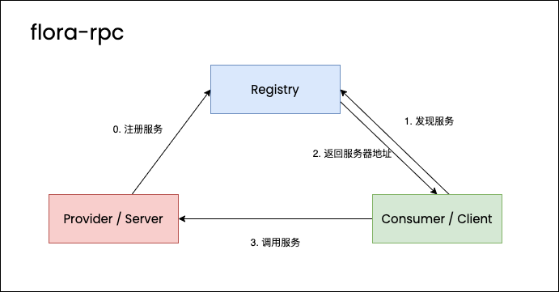

# flora-rpc

一个 rpc 框架，为`flora-framework` 提供了远程过程调用的能力



0. RPC Server 把 Service 注册到注册中心
1. RPC 客户端请求注册中心
2. 注册中心返回 Service 所在的 Rpc Server 的地址
3. RPC 客户端请求 RPC Server
4. RPC Server 收到请求，调用请求目标方法
5. RPC Server 把调用结果返回给 RPC Client
6. RPC Client 收到响应，调用完毕

## Features

- [x] 自定义 rpc 通信协议
- [x] 心跳检测，长连接
- [x] 负载均衡
- [x] Zookeeper 管理服务
- [x] Kryo 序列化，同时支持配置更多的序列化机制
- [x] 注解配置消费服务，发布服务

## flora-rpc 通信协议

```
  0       4         5              6                7               8    11      15   (16B)
  +-------+---------+--------------+----------------+---------------+----+--------+
  | magic | version | message type | serialize type | compress type | id | length |
  +-------------------------------------------------------------------------------+
  |                                     body                                      |
  +-------------------------------------------------------------------------------+
```

|     field      |    name    |                     description                      |
| :------------: | :--------: | :--------------------------------------------------: |
|     magic      |    魔数    |               用于快速判断是否是无效包               |
|    version     |   版本号   |                     用于协议升级                     |
|  message type  |  消息类型  | 可能是请求包，响应包，心跳检测请求包，心跳检测响应包 |
| serialize type | 序列化类型 |                                                      |
| compress type  |  压缩类型  |                                                      |
|       id       |  报文 id   |                                                      |
|     length     |  报文长度  |                                                      |
|      body      |  报文数据  |                                                      |

## TODO

- [ ] 支持通信数据压缩
- [ ] 更多的负载均衡策略
- [ ] 服务监控
